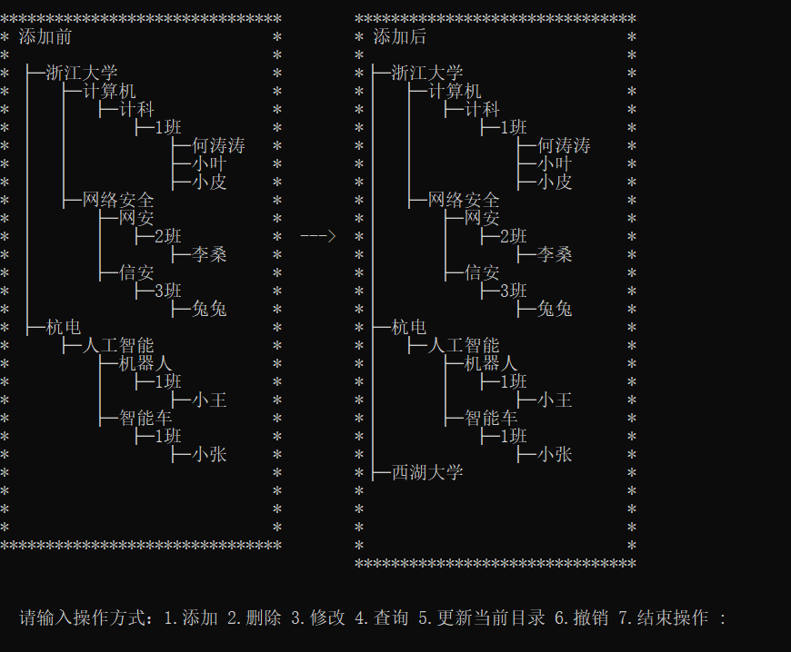

# 学生管理系统
本课题为大二上学期数据结构课程设计大作业。

因期末时间不足，实现的不是很完善，主要可以参考实现的**树形目录结构**。

## 详细介绍

以多叉树构建学生管理系统，用树形目录结构展示

主要能够实现以下几个功能：

1.增加任意一个学校、学院、专业、班级和学生。

2.删除任意一个学校、学院、专业、班级和学生。

3.修改学生信息。

4.查询任意一个学校、学院、专业、班级和学生。

5.撤销操作。

以下为增加功能的展示：

 
